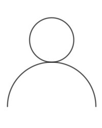
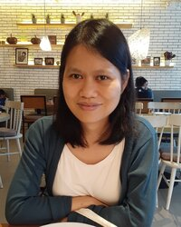
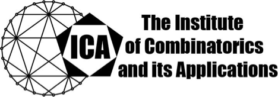

---
#
# You don't need to edit this file, it's empty on purpose.
# Edit sleeks's default layout instead if you wanna make some changes
# See: https://jekyllrb.com/docs/themes/#overriding-theme-defaults
#
layout: default
title: Combinatorics in Christchurch
---
**Combinatorics in Christchurch** aims to bolster the combinatorial community in New Zealand by bringing together mathematicians working in combinatorics and related fields.

## Key information
- **Dates:** 4 - 6 June 2024
- **Location:** [University of Canterbury](https://www.canterbury.ac.nz/), Christchurch, New Zealand
- **Cost:** Free to attend.
- **Deadline for registration and abstract submission:** 19 April, 2024

## Invited speakers

|  |    [Bill Martin](https://www.wpi.edu/people/faculty/martin)   Worcester Polytechnic Institute,   USA | |
|:--:|:--:|:--:|
|   |   |   |
| [Carmen Amarra](https://math.upd.edu.ph/faculty/amarra-maria-carmen)   University of the Philippines Diliman,   Philippines  | [John Bamberg](https://johnbamberg.github.io/)   The University of Western Australia,  Australia | [Gary Greaves](https://personal.ntu.edu.sg/gary/)   Nanyang Technological University,   Singapore |
|  |  |  |
| [Anita Liebenau](https://sites.google.com/site/aliebenau/home),   University of New South Wales,   Australia |  [Sho Suda](https://researchmap.jp/7000005386?lang=en),   National Defense Academy of Japan,   Japan | TBC |

## Organisers
[Jesse Lansdown](https://www.jesselansdown.com/), University of Canterbury  
[Geertrui Van de Voorde](https://www.canterbury.ac.nz/engineering/contact-us/people/geertrui-van-de-voorde.html), University of Canterbury

## Sponsors and support

|  |  |
|:--:|:--:|
|  | [The Institute of Combinatorics and its Applications](http://the-ica.org/) |

